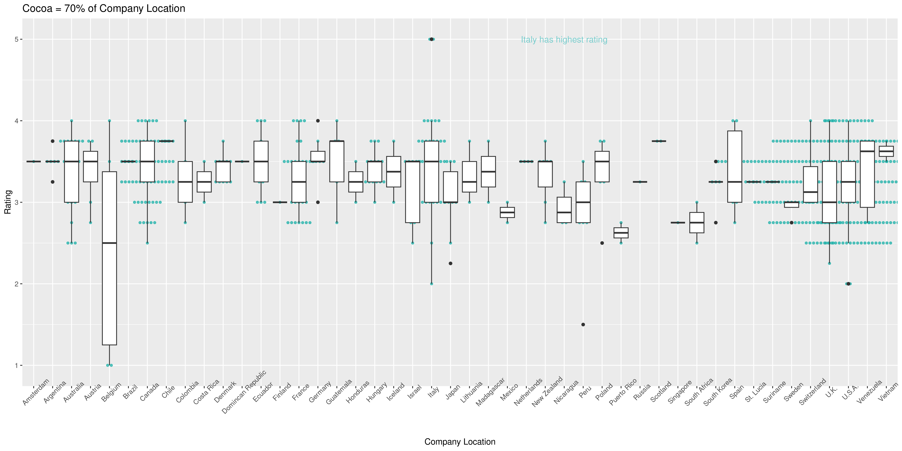

```{r setup, include=FALSE}
knitr::opts_chunk$set(echo = TRUE)
```

# Summary
_This project is from one of the course assignements from the Coursea, which is used as my first blog post using R Markdown._


**Chocolate and Tea **aims to serve chocolate bars that are highly rated by professional critics. They also continually adjust the menu to make sure it reflects the global diversity of chocolate production. The management team regularly updates the chocolate bar list in order to align with the latest ratings and to ensure that the list contains bars from a variety of countries. 

They’ve asked you to collect and analyze data on the latest chocolate ratings. In particular, they’d like to know which countries produce the highest-rated bars of super dark chocolate (a high percentage of cocoa). This data will help them create their next chocolate bar menu. 

### First, import template csv file:
```{r CSV file upload, message=FALSE, warning=FALSE}
library(readr)
df <- read_csv("../../Downloads/flavors_of_cacao.csv")
# Current Directly is '/home/nwise/project/R_Markdown'
colnames(df)
```
### Clean the data 
Since column names are messy in this table such as 'Company (Maker-if known)' which contains space or ( ).

Let's rename them first:
```{r clean table, message=FALSE, warning=FALSE}
#Pipe (%>%) package:
library(magrittr)
#clean_names package:
library(janitor)
#Rename package:
library(tidyverse)
df <- clean_names(df)
colnames(df)
#Rename to simpler form:
df1 <-df %>% 
  rename(c(company = company_maker_if_known, bean_origin = specific_bean_origin_or_bar_name))
```
### Trim the data
Now we will select variables that will be used for analysis.
We need:

* Rating
* Cocoa Percent
* Company Location

Then, calculate the mean of rating:

```{r trim}
# Calculate the mean of rating
trimmed_df1 <- df1 %>% 
  select(company, rating, cocoa_percent, company_location)
summarise(trimmed_df1, mean(trimmed_df1$rating))
```

After completing your analysis of the rating system, you determine that any rating greater than or equal to **3.75** points can be considered a high rating. 

You also know that Chocolate and Tea considers a bar to be super dark chocolate if the bar's cocoa percent is greater than or equal to **80%**. You decide to create a new data frame to find out which chocolate bars meet these two conditions. 
```{r dark chocolate}
best_cocoa_df1 <- trimmed_df1 %>%
  filter(cocoa_percent >= 80, rating >=3.75)
best_cocoa_df1
```
### Create Visualization Case 1:
#### Best Dark Chocolate Bar: Count vs Company Location 
ggplot2 is used for data visualization.
```{r ggplot_company_location}
library(ggplot2)
ggplot(data=best_cocoa_df1)+ 
  geom_bar(mapping = aes(x=company_location, fill=rating))+
  labs(title="Company Locations of Best Rated Dark Chocolate Bars", 
       subtitle = "Best dark chocolate bar: Cocoa % >= 80%, and Rating >= 3.75")
```

**Observation**: US produces most cocoa, but both Canada and France produce good rated cocoa. 

### Create Visualization Case 2:
#### Visualize the Big Picture 

I would like to know where the data is clustered. 
First, convert character to number in the cocoa_% column, then plot:

```{r convert to num}
trimmed_df2 <- trimmed_df1 %>%
 mutate(cocoa_num= as.numeric(str_replace(cocoa_percent, "%", ''))) 
#View(trimmed_df2)

higest_cocoa_percent <- trimmed_df2 %>% 
  group_by(cocoa_num) %>% 
  summarise(company_location,rating)
#View(higest_cocoa_percent)

cocoa_70 <-higest_cocoa_percent %>% 
  filter(cocoa_num==70)

ggplot(higest_cocoa_percent, aes(x=cocoa_num))+
  geom_bar()+
  geom_bar(data=cocoa_70, fill='darkturquoise')+
  xlab("Cocoa Contents (%)") +
  ylab("# of Data Points")+
  labs(title="Data Overview")+
  scale_x_continuous(breaks=seq(40,100,10))+
  annotate("text", label="70% has most data points.", x=80, y=600, color="darkslategray3")
```

According to the "Data Overview" plot, cocoa % = 70% has highest number of data points.

I want to filter out and group by company location:

```{r cocoa_70}
cocoa_70 %>% 
  group_by(company_location) %>% 
  summarise(rating)

ggplot(cocoa_70, aes(x=company_location,y=rating))+
  geom_dotplot(binaxis='y',
               stackdir='center',
               stackratio = 1.5, 
               binwidth = .1,
               binpositions = "all",
               dotsize=0.3,
               alpha = .75,
               fill = "lightseagreen", 
               colour = "lightseagreen",
               na.rm = TRUE)+
  scale_y_continuous(breaks=seq(1,5,1))+
  geom_boxplot()+
  xlab("Company Location") +
  ylab("Rating")+
  labs(title="Cocoa = 70% of Company Location")+
  theme(axis.text.x = element_text(angle = 45))+
  annotate("text",label="Italy has highest rating", x=29, y=5, color="darkslategray3")
```

Since the x-axis is too crowed to see, I used ggsave to expand the image size:

```{r cocoa_70_ggsave}
ggsave("company_location_Rating.png", width = 16, height=8)
```


**Observations:** Italy has best rating chocolate bars between 70% cocoa contents.  

